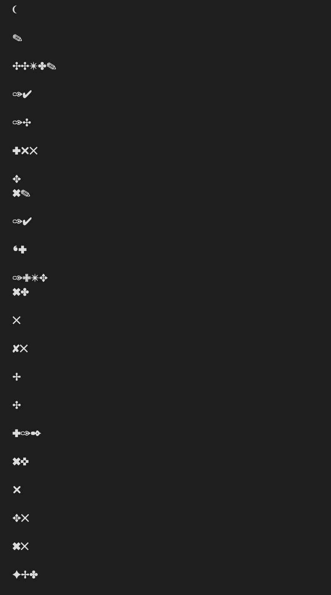

# AI JEE AGENT DOCUMENTATION AND  DECISIONS

## Extraction-

### 1) See if overall extraction is good
### 2) Formualas and denotions
### 3) Check for layout aware (Tables and Images) 

### pydf

Garbled Unicode from pypdf in Chemistry part 2 class 12th , will reject pypdf. 

Why garbled Unicode? PDF contains custom font encoding (Cmap) Character Map references, tried copy-paste the text in the notepad, confirmed it's a problem with pdf, pasted text are in unicode symbols

Pymupdf gives the same result
will try tesseract
Compared with Docling, Docling seems a better fit as it provides structural layout, lightweight and can also help extract formulas

Docling with OCR is taking too much time, while without OCR, with table layout aware giving worse results than previous methods, docling was not working correctly - having MPS float64 inssue, also had to change it to use CPU

Will switch to Marker-pdf as suggested by claude, Rejecting marker too RAM hungry

will switch to PIL image extraction from pdf anf then pytesseract

Even Pytesseract is failing to extract text like question and even text with them, tried different configuration of oem and psm, still the same results

Will use OCR with Docling on google colab

OCR not working, will fallback to pymupdf and try to work with garbled uniocode

## Chunking -

### splitting by characters manually 

splitting by characters only made too much junk, removed Table of Content using density filter coded customly

also made metadata for every book/doc

we used characters = 4000 which is roughly 1000 tokens which exceeds the limit of BGE but we can change the threshold

### Recursive Text Splitter (Character)

### Semantic Chunking
will try after getting retrieval set up 
