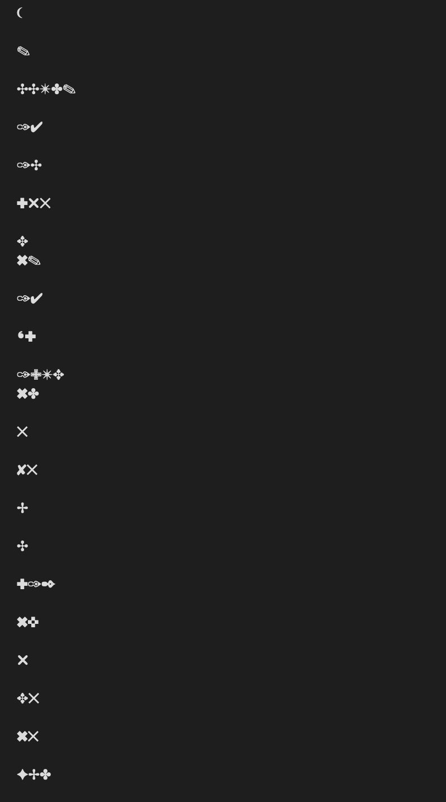

# AI JEE AGENT DOCUMENTATION AND  DECISIONS

## Extraction-

### 1) See if overall extraction is good
### 2) Formualas and denotions
### 3) Check for layout aware (Tables and Images) 

### pydf

Garbled Unicode from pypdf in Chemistry part 2 class 12th , will reject pypdf. 

Why garbled Unicode? PDF contains custom font encoding (Cmap) Character Map references, tried copy-paste the text in the notepad, confirmed it's a problem with pdf, pasted text are in unicode symbols

Pymupdf gives the same result
will try tesseract
Compared with Docling, Docling seems a better fit as it provides structural layout, lightweight and can also help extract formulas

Docling with OCR is taking too much time, while without OCR, with table layout aware giving worse results than previous methods, docling was not working correctly - having MPS float64 inssue, also had to change it to use CPU

Will switch to Marker-pdf as suggested by claude, Rejecting marker too RAM hungry

will switch to PIL image extraction from pdf anf then pytesseract

Even Pytesseract is failing to extract text like question and even text with them, tried different configuration of oem and psm, still the same results

Will use OCR with Docling on google colab

OCR not working, will fallback to pymupdf and try to work with garbled uniocode

Fixed some things, removed table of contents, appendix etc, and junk lines by defining them manually and scanning through the text before writing them in .txt file

### Chunking -

Every chunk was given id starting from 0 and common to all chunks irrespective of books they came from unlike before

added page number and source in meta

Changed this both for quicker and easier debugging

### splitting by characters manually 

splitting by characters only made too much junk, removed Table of Content using density filter coded customly

also made metadata for every book/doc

we used characters = 4000 which is roughly 1000 tokens which exceeds the limit of BGE but we can change the threshold

### Recursive Text Splitter (Character)
Hardcoded it, but too many chunks and shortest length of chunk is 1 and longest is 440
to make it better we may merge if len(merged) < max chunk size

hardcoding it will pose a problem, since we are using split and no overlapping, no metadata, merge small pieces

so we will now use langchain's framework for the same

Changed the source of data, works fine now

fixed few bugs in chunking, was taking len() which counts characters not tokens so used tokenizer from transformers for count function
Removed pages like table of content, used filter to drop chunk below 20 character count

### Semantic Chunking
will try after getting retrieval set up 

### Embeddings

Chose asymmetric bge-en embedding model, wrote from transformers module. (need to check metrics for both asymmetric and symmetric)

Changed the data from ncert to openstax.org physics and chemistry volumes since extracted content was better unlike NCERT where the garbled unicode formed useless chunks and embeddings and was taking to time to embed them
Output for NCERT was 100 in token, useless

We set the threshold for retrieval 0.6 by running a few queries and testing on small chunks and test set

Threshold in code is actually 0.55 not 0.6, lowered while testing and never written down here. A 12 query sweep confirms it blocks 5 of 6 off-topic queries at retrieval, but "how to cook pasta" still gets 6 chunks through on lexical overlap with thermal physics, so the bi-encoder alone is not a sufficient off-topic gate - see Reranker below.

## todo: 1. will calculate MRR and other metrics.

### Reranker
used BGE base reranker for reranking, taking top 20 chunks from from encoder and then reranking to dcreasingly and sending all chunks
Set up reranker from scratch from transformers module

retrieve() actually returns k=10 not 20, and rerank returns top 5 not all chunks.

Added threshold=0 to rerank, mirroring the threshold param already on retrieve. The cross-encoder scores were being computed and then dropped in integration.py, so the off-topic signal existed but was unused. Picked 0 from a 12 query sweep - on-topic ran 0.57 to 7.19 with all 5 chunks positive every time, off-topic ran -6.26 to -1.87 with nothing positive. 2.4 wide empty gap and 0 sits in the middle of it. Off-topic queries now return no chunks and never reach the LLM, so they cost nothing.

Moved the reranker to MPS. It had been on CPU the whole time, reranker.py never called .to(device) unlike embeddings.py. I had thought MPS was slower when I checked before, but that was cold start hiding it - first call is 3-5s on either device, warm is 3.95s CPU vs 1.46s MPS with both models resident, 2.72x. Timing MPS needs torch.mps.synchronize() or the numbers are wrong in the fast direction. Moving the model alone is not enough, inputs need .to(device) too or it raises "Placeholder storage has not been allocated on MPS device". Scores bit identical after the move, so this is free.

### LLM INTEGRATION

128K Context Window for this model

Set up Groq 70B versatile model for LLM answer
gave context/chunks to LLM with different structure for chunks - block of a single context/chunk, example - chunk 1| chunk_id 100 | chunk_souce - book | chunk text
giving to LLM after reranking

Model in code is openai/gpt-oss-120b now, not llama-3.3-70b-versatile.

Added rule 6 to the system prompt - end the reply with a "CITATIONS: <id>, <id>" line. Needed because the model's inline citation format is not stable between runs, saw 【chunk_id 165】 one run and 【Chunk‑1 | 2121】 the next for the same query, so a regex over free text will always be chasing it. Kept both checks as a union rather than replacing the regex, because compliance with rule 6 is not guaranteed either - 1 of 2 live runs emitted the line, and the two answers each passed via a different path.

## Todo: 1. Eval Metrics and best prompt eval and compare answers to eval data set
         2. Calculate and find the token length of our total prompt combined since context window includes input+ouput and format according to that
         measured so far: prompt ~2300-2500 tokens, completion ~1000-1600, total ~3400-4000 per query. Well inside the 128K window, budgeting still todo.
         3. Convert this into an agent with routing and tools (Math, theoru, syllabus, Online web search)

### Wrappers and API function (Resilience and Observability)

## todo: 1. defining token limit, context window, logging, retrying token counting and timeout
      2. Study these functions and implmentations

Done: max_retries=0 on the Groq client so the custom loop owns retries. It was never actually set - SDK default is 2, so the loop of 3 was nesting over the SDK's 3 and every retryable failure fanned out to 9 requests. Also timeout=30s, there was none before so the default 60s read applied to each of those.

Split the except. BadRequestError, AuthenticationError and NotFoundError all subclass APIStatusError, so the single except was retrying 400s and 401s three times with backoff before giving up and telling the user to try again in a moment, which is wrong advice for a bad key. They now return immediately and log the real reason.

Swapped APITimeoutError for APIConnectionError in the retry except. APITimeoutError subclasses APIConnectionError, so this still catches timeouts and additionally catches plain connection failures, which were uncaught before and crashed the request into a 500.

Still open from the todo above: token limit / context window budgeting, and logging.

 ### Guardrails

Set up guardrails 
for Input - prompt injection, bad words, empty messages and length check returning Not allowed 
For Output - Matching if chunk ids cited by LLM and given to it are same and letting the user if it hallucinated

Two bugs in the input patterns. \bignore\s+(all|previous|above|prior)\s+instructions\b allows exactly one word between the verb and "instructions", so "ignore previous instructions" was blocked but "ignore all previous instructions" - the actual canonical string - passed straight through. Replaced the three ignore/forget/disregard patterns with one, verb + up to 40 chars + instructions, using [\s\S] so a multi line paste still matches.

\bact\s+as\b was refusing legitimate chemistry - acids act as proton donors, metals act as reducing agents, water act as both an acid and a base. \bdan\b was refusing "Dan Shechtman". Both narrowed to the persona form, either second person "you act as" or act as + a persona word. 13/13 attacks blocked and 0/10 legit queries blocked after.

Output check was firing on nearly every answer - the regex matched only 4 of 12 realistic citation formats, so it was reporting formatting mismatches as hallucinations. See LLM INTEGRATION for the CITATIONS line.
 
### Backend and Deployment
All fastapi and every not in async per time query after first query 

I measured where the bottleneck actually is under concurrent load CPU compute in the reranker, not thread availability and async only addresses the second one. Converting to async would add real complexity (a new client, wrapping blocking calls, re-testing everything) to fix a problem I don't have at the traffic I'm actually serving. I'd revisit it if a load test ever showed requests queuing for threads specifically — that's the condition that would justify it, and I haven't seen that condition

requirements.txt was a freeze of the venv, 149 packages, 28 of them from the rejected extraction experiments (docling, marker-pdf, surya-ocr, pytesseract, opencv) plus unrelated things, and it was missing fastapi and uvicorn entirely - so a fresh clone could pip install successfully and then not run the server. Cut to the 10 packages actually imported, pinned to the venv.

embeddings.py could not bootstrap. The np.load at module level ran on import, before the encode_all() in __main__ could create the file, and encode_all wrote into embeddings/ without creating it while embeddings/ is gitignored. So step 3 of the README setup crashed on any fresh clone. Load is now guarded on the file existing, and out_dir gets mkdir(exist_ok=True) like the other two pipeline scripts already had.